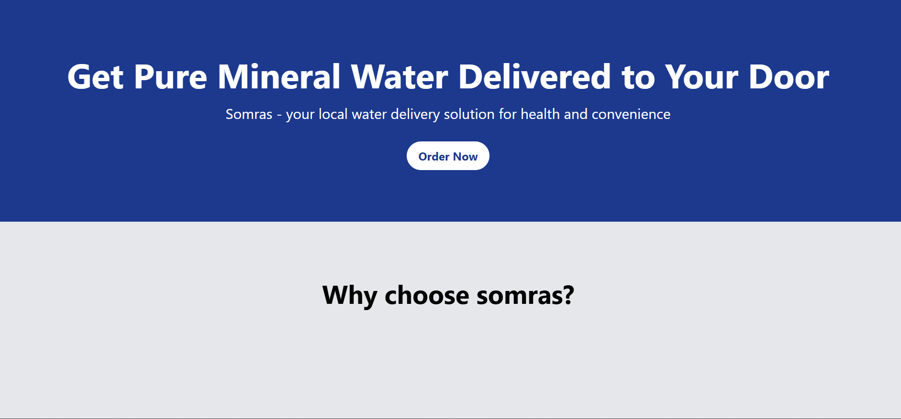
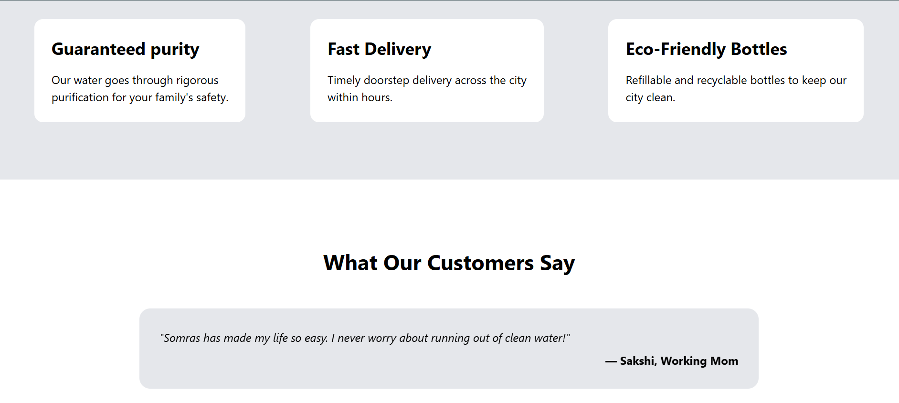
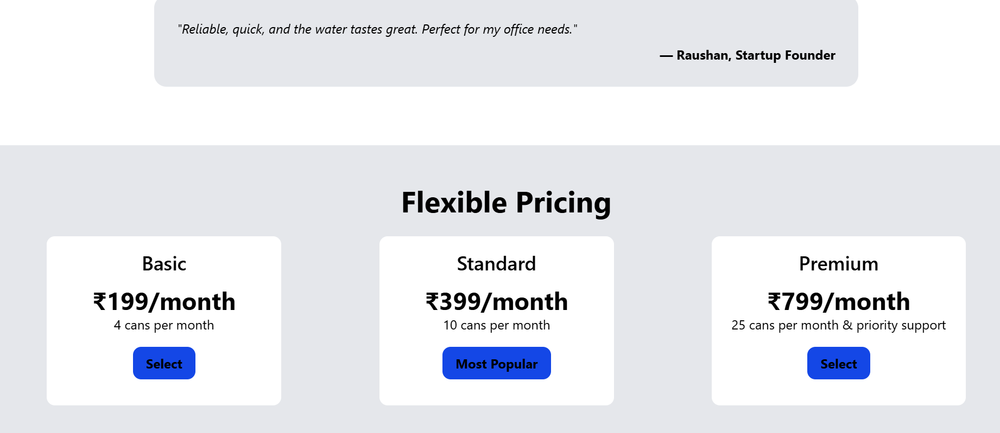
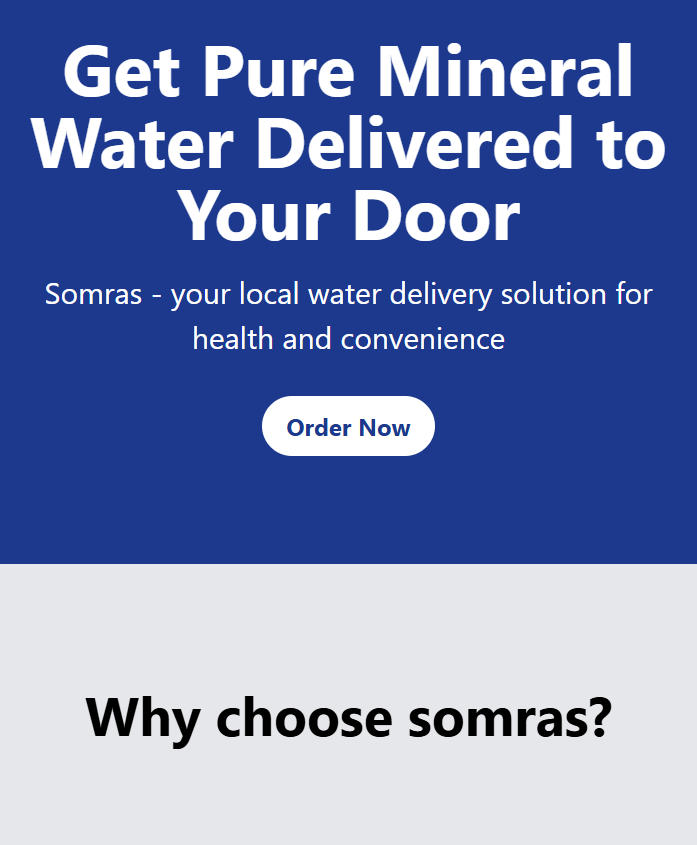
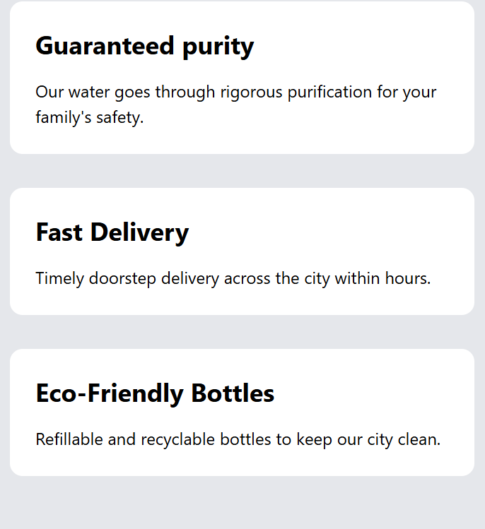
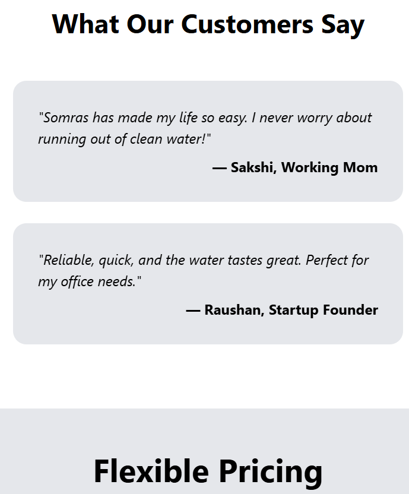

# Somras Startup Landing Page

A modern, responsive landing page for a water delivery startup, built with [Tailwind CSS](https://tailwindcss.com/) and [AOS (Animate On Scroll)](https://michalsnik.github.io/aos/).

## Features

- **Hero Section:** Eye-catching headline with animated effects.
- **Features Section:** Highlights the main selling points with responsive cards.
- **Testimonials:** Customer feedback with AOS animations.
- **Pricing Plans:** Three-tier pricing cards with hover scaling effects.
- **Contact Form:** Simple form for user inquiries.
- **Responsive Design:** Looks great on mobile, tablet, and desktop.
- **Modern Fonts:** Uses Helvetica for a clean, professional look.
- **No frameworks required:** Works with CDN links for Tailwind and AOS.
  ## Technologies Used

- [Tailwind CSS](https://tailwindcss.com/) (via CDN)
- [AOS (Animate On Scroll)](https://michalsnik.github.io/aos/) (via CDN)
- HTML5 & CSS3
## ScreenShots

